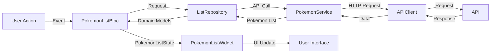
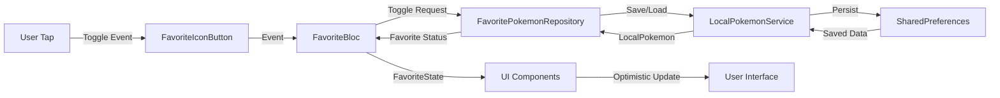
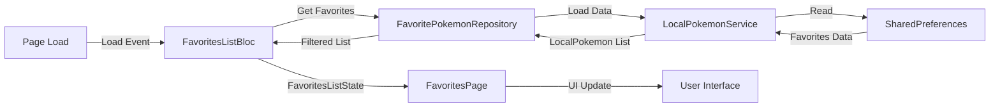
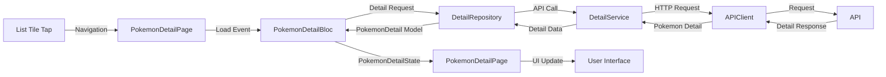

# Flutter Architecture Overview

This document describes the comprehensive architecture of the Flutter Pokemon app, including the enhanced BLoC pattern implementation, navigation system, and data management layers.

## Architecture Layers

### Presentation Layer
- **Pages**: `MainNavigationPage`, `PokemonListPage`, `FavoritesPage`, `PokemonDetailPage`
- **Widgets**: `PokemonListWidget`, `FavoriteIconButton`
- **Navigation**: Bottom navigation with `IndexedStack` for state preservation, detail page navigation

### State Management Layer (BLoC Pattern)
- **PokemonListBloc**: Manages Pokemon list loading, pagination, and refresh
- **PokemonDetailBloc**: Handles Pokemon detail loading and state management
- **FavoriteBloc**: Global bloc managing favorite states across all pages
- **FavoritesListBloc**: Handles favorites list display and management

### Domain Layer
- **Repositories**: `ListRepository`, `FavoritePokemonRepository`, `DetailRepository`
- **Models**: `Pokemon`, `ListEntity`, `DetailEntity`, `LocalPokemon`, `PokemonDetail`

### Data Layer
- **Services**: `PokemonService`, `DetailService`, `LocalPokemonService`
- **Networking**: `APIClient`, `RequestBuilder`
- **Storage**: `SharedPreferences` via `LocalPokemonService`

## BLoC Architecture Details

### PokemonListBloc
**Purpose**: Manages Pokemon list data loading and pagination
**Events**:
- `PokemonListLoadRequested`: Initial load or refresh
- `PokemonListLoadMoreRequested`: Load next page for infinite scroll

**States**:
- `PokemonListInitial`: Initial state
- `PokemonListLoading`: Loading state with optional previous data
- `PokemonListSuccess`: Success state with Pokemon list
- `PokemonListError`: Error state with message and previous data

### FavoriteBloc (Global)
**Purpose**: Manages favorite states across all pages
**Events**:
- `FavoriteLoadAllRequested`: Load all favorite statuses on app startup
- `FavoriteToggled`: Toggle favorite status for a specific Pokemon

**States**:
- `FavoriteSuccess`: Contains favorite status map
- `FavoriteError`: Error state with previous favorite status map

### FavoritesListBloc
**Purpose**: Manages favorites list page display and refresh
**Events**:
- `FavoritesListLoadRequested`: Load favorites list on page initialization
- `FavoritesListRefreshRequested`: Refresh favorites list on pull-to-refresh

**States**:
- `FavoritesListInitial`: Initial state
- `FavoritesListLoading`: Loading state
- `FavoritesListSuccess`: Success state with favorite Pokemon list
- `FavoritesListError`: Error state with message and previous data

### PokemonDetailBloc
**Purpose**: Manages Pokemon detail loading and state management
**Events**:
- `PokemonDetailLoadRequested`: Load Pokemon detail by ID

**States**:
- `PokemonDetailInitial`: Initial state
- `PokemonDetailLoading`: Loading state while fetching detail
- `PokemonDetailSuccess`: Success state with Pokemon detail data
- `PokemonDetailError`: Error state with error message

## Data Flow Architecture

### Pokemon List Flow


### Favorite Toggle Flow


### Favorites List Flow


### Pokemon Detail Flow


## Enhanced Data Model

### LocalPokemon Model
```dart
class LocalPokemon {
  final String id;
  final String name;
  final String imageURL;      // NEW: Image URL for display
  final bool isFavorite;
  final int created;          // NEW: Creation timestamp
}
```

**Enhancements**:
- Added `imageURL` for Pokemon image display
- Added `created` timestamp for sorting favorites by creation time
- Maintains backward compatibility with existing data

## Repository Pattern

### ListRepository
- Handles Pokemon list pagination and JSON parsing
- Maps API responses to domain models
- Manages error handling and data transformation

### DetailRepository
- Handles Pokemon detail fetching and data transformation
- Maps API responses to PokemonDetail domain model
- Manages error handling and data validation
- Provides abstraction for testing

### FavoritePokemonRepository
- Manages favorite Pokemon persistence
- Provides operations: `isFavorite`, `toggleFavorite`, `getFavoritePokemonList`, `getAllFavoriteStatus`
- Handles data filtering and sorting
- Implements conservative error handling

## Service Layer

### LocalPokemonService
- Wraps `SharedPreferences` for local storage
- Provides CRUD operations for `LocalPokemon` objects
- Handles JSON serialization/deserialization
- Implements service specification pattern for testing

### PokemonService & DetailService
- Share singleton `APIClient` for consistent request handling
- Use `RequestBuilder` for typed request assembly
- Implement error handling and response parsing

## Navigation Architecture

### MainNavigationPage
- Provides bottom navigation between Pokemon list and favorites
- Uses `IndexedStack` for state preservation
- Integrates with global BLoC providers

### PokemonDetailPage
- Displays comprehensive Pokemon information
- Integrates with global `FavoriteBloc` for favorite functionality
- Provides navigation back to list with state preservation
- Handles loading states and error scenarios

### State Preservation
- `IndexedStack` maintains page state during navigation
- BLoC states are preserved across page switches
- User interactions maintain context

## Testing Architecture

### BLoC Testing
- Uses `bloc_test` package for comprehensive BLoC testing
- Tests success/error branches for all BLoCs including PokemonDetailBloc
- Mocks dependencies using `mockito`
- Tests detail loading, error handling, and state transitions

### Repository Testing
- Tests data transformation and error handling
- Validates persistence operations
- Tests data filtering and sorting logic
- Tests DetailRepository API integration and data mapping

### Integration Testing
- Tests navigation between pages including detail page navigation
- Verifies state consistency across BLoCs
- Tests user interaction flows including detail page interactions
- Tests favorite functionality integration in detail page

## Dependency Injection

### BLoC Providers
```dart
MultiBlocProvider(
  providers: [
    BlocProvider(create: (context) => FavoriteBloc()),
    BlocProvider(create: (context) => FavoritesListBloc()),
  ],
  child: MaterialApp(home: MainNavigationPage()),
)
```

### Repository Injection
- Repositories are injected into BLoCs via constructor
- Services are injected into repositories
- Enables easy testing with mock dependencies

## Error Handling Strategy

### BLoC Level
- Preserve previous state during errors
- Provide user-friendly error messages
- Implement retry mechanisms

### Repository Level
- Conservative error handling for read operations
- Rethrow errors for write operations
- Provide safe defaults for failed operations

### UI Level
- Show loading states during operations
- Display error messages via SnackBar
- Maintain UI consistency during errors

## Performance Considerations

### State Management
- Use `buildWhen` to optimize widget rebuilds
- Implement efficient state comparison
- Minimize unnecessary BLoC emissions

### Data Loading
- Implement pagination for large datasets
- Use optimistic updates for favorites
- Cache frequently accessed data

### Navigation
- Use `IndexedStack` for state preservation
- Avoid rebuilding pages during navigation
- Implement efficient page switching

## Future Architecture Considerations

### Scalability
- Consider implementing a more complex navigation stack
- Add support for deep linking
- Implement advanced state management patterns

### Testing
- Add integration tests for complete user flows
- Implement UI testing for critical paths
- Add performance testing for large datasets

### Features
- Add search functionality across pages
- Implement offline support for Pokemon details
- Add push notifications for favorites
- Enhance detail page with additional Pokemon information
- Add Pokemon comparison functionality

This architecture provides a solid foundation for the Pokemon app while maintaining clean separation of concerns, excellent testability, and great user experience.
