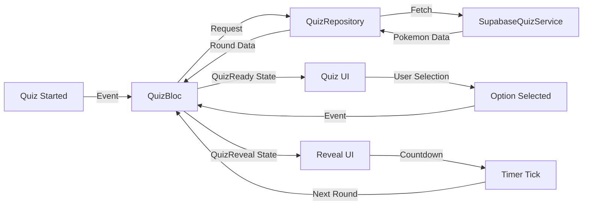

# Pokemon Quiz Feature Documentation

This document describes the comprehensive Pokemon Quiz feature implementation, including the enhanced UI with layered image display and extended countdown timing.

## Feature Overview

The Pokemon Quiz feature provides an interactive "Who's That Pokémon" experience with:
- **Silhouette Guessing**: Players guess Pokemon from silhouette images
- **Reveal State**: Shows the original Pokemon image and name after selection
- **Automatic Round Reset**: 5-second countdown before starting the next round
- **Enhanced UI**: Layered image display with smooth transitions
- **Supabase Integration**: Backend-powered quiz rounds with cached assets

## Architecture Components

### QuizBloc
**Purpose**: Manages quiz state, round progression, and countdown timing
**Events**:
- `QuizStarted`: Initialize a new quiz round
- `QuizOptionSelected`: Handle player's Pokemon selection
- `QuizCountdownTick`: Internal countdown timer events

**States**:
- `QuizLoading`: Initial loading state while fetching quiz data
- `QuizReady`: Ready state with Pokemon options and silhouette image
- `QuizReveal`: Reveal state showing correct answer with countdown
- `QuizError`: Error state with retry functionality

### QuizRepository
**Purpose**: Manages quiz data fetching and caching
**Responsibilities**:
- Fetch Pokemon list from Supabase
- Create quiz rounds with random Pokemon selection
- Cache Pokemon data for performance
- Handle network errors and retries

### SupabaseQuizService
**Purpose**: Backend integration for quiz data
**Features**:
- Supabase edge function integration
- Pokemon list caching
- Silhouette and official image URLs
- Error handling and retry logic

## Enhanced UI Implementation

### Layered Image Display
The quiz features an enhanced image display system with two layers:

```dart
class _QuizImageCard extends StatelessWidget {
  const _QuizImageCard({
    required this.silhouetteUrl,
    required this.originalUrl,
    required this.description,
    required this.isRevealed,
  });

  final String silhouetteUrl;
  final String originalUrl;
  final String description;
  final bool isRevealed;
```

**Implementation Details**:
- **Back Layer**: Original Pokemon image (visible when revealed)
- **Front Layer**: Silhouette image (visible when not revealed)
- **Smooth Transitions**: Visibility-based switching between layers
- **Error Handling**: Fallback icons for failed image loads

### Quiz States UI

#### QuizReady State
- Displays silhouette image with "Guess the Pokémon" description
- Shows 4 Pokemon options as buttons
- Handles user selection and immediate feedback

#### QuizReveal State
- Shows original Pokemon image with "It's {Name}" description
- Displays selected option with visual feedback (check/cross icons)
- 5-second countdown timer before next round
- Automatic progression to next round

## Countdown Timing Enhancement

### Extended Countdown Duration
The quiz countdown has been extended from 3 seconds to 5 seconds for better user experience:

```dart
class QuizBloc extends Bloc<QuizEvent, QuizState> {
  QuizBloc({
    QuizRepository? repository,
    int countdownSeconds = 5,  // Extended from 3 to 5 seconds
  }) : _repository = repository ?? QuizRepository(),
       _countdownSeconds = countdownSeconds,
       super(const QuizLoading()) {
```

### Countdown Implementation
- **Timer Management**: Uses Dart Timer for precise countdown control
- **State Updates**: Emits countdown remaining with each tick
- **Automatic Reset**: Triggers next round when countdown reaches zero
- **User Experience**: Provides clear visual feedback of remaining time

## Option Button Enhancements

### Visual Feedback System
The quiz option buttons now include enhanced visual feedback:

```dart
class QuizOptionButton extends StatelessWidget {
  // Enhanced styling with feedback colors and borders
  Color? _iconColorFor(PokemonQuizOption option, bool showFeedback) {
    if (!showFeedback) return null;
    
    switch (option.feedback) {
      case QuizOptionFeedback.check:
        return Colors.green;
      case QuizOptionFeedback.cross:
        return Colors.red;
      case QuizOptionFeedback.none:
        return null;
    }
  }
```

**Feedback Features**:
- **Check Icons**: Green checkmarks for correct answers
- **Cross Icons**: Red crosses for incorrect answers
- **Color Coding**: Green/red borders and backgrounds
- **Icon Integration**: Seamless icon display with proper colors

## Data Flow Architecture

### Quiz Round Flow


### State Transitions
1. **Loading**: Fetch Pokemon data from Supabase
2. **Ready**: Display silhouette and options
3. **Reveal**: Show correct answer with countdown
4. **Next Round**: Automatic progression after countdown

## Testing Implementation

### BLoC Testing
- **Countdown Tests**: Validate 5-second countdown behavior
- **State Transitions**: Test all quiz state changes
- **Error Handling**: Network and service error scenarios
- **Mock Integration**: Repository and service mocking

### Widget Testing
- **Image Display**: Silhouette and original image rendering
- **Option Buttons**: Visual feedback and interaction
- **Countdown UI**: Timer display and progression
- **Error States**: Retry functionality and error messages

### Repository Testing
- **Supabase Integration**: Edge function calls and responses
- **Caching Logic**: Pokemon data caching and retrieval
- **Error Scenarios**: Network failures and retry logic

## Configuration

### Supabase Setup
```dart
// Environment variables required
SUPABASE_URL=<your-supabase-url>
SUPABASE_ANON_KEY=<your-anon-key>
```

### Quiz Configuration
```dart
// Customizable countdown timing
QuizBloc(countdownSeconds: 5)  // Default 5 seconds
```

## Performance Considerations

### Image Caching
- **CachedNetworkImage**: Efficient image loading and caching
- **Placeholder Handling**: Loading indicators during image fetch
- **Error Recovery**: Fallback icons for failed loads

### State Management
- **Efficient Updates**: Minimal state emissions during countdown
- **Memory Management**: Proper timer cleanup and disposal
- **Resource Optimization**: Cached Pokemon data for performance

## Error Handling

### Network Errors
- **Retry Logic**: Automatic retry for failed requests
- **User Feedback**: Clear error messages with retry options
- **Graceful Degradation**: Fallback to cached data when possible

### Service Errors
- **Supabase Failures**: Handle edge function errors
- **Data Validation**: Ensure quiz data integrity
- **Fallback Mechanisms**: Default behavior for missing data

## Future Enhancements

### Planned Features
- **Difficulty Levels**: Easy/Medium/Hard quiz modes
- **Score Tracking**: Player progress and statistics
- **Custom Rounds**: User-selected Pokemon categories
- **Multiplayer Support**: Competitive quiz modes

### Performance Improvements
- **Advanced Caching**: More sophisticated data caching
- **Image Optimization**: Compressed and optimized images
- **Offline Support**: Local quiz data for offline play

## Development Guidelines

### Adding New Features
- Follow BLoC pattern for state management
- Implement comprehensive testing
- Use proper error handling and user feedback
- Maintain performance and memory efficiency

### Testing Requirements
- Unit tests for all BLoC logic
- Widget tests for UI components
- Integration tests for complete flows
- Performance tests for timing accuracy

This comprehensive quiz feature provides an engaging Pokemon guessing experience with enhanced UI, extended timing, and robust error handling.
